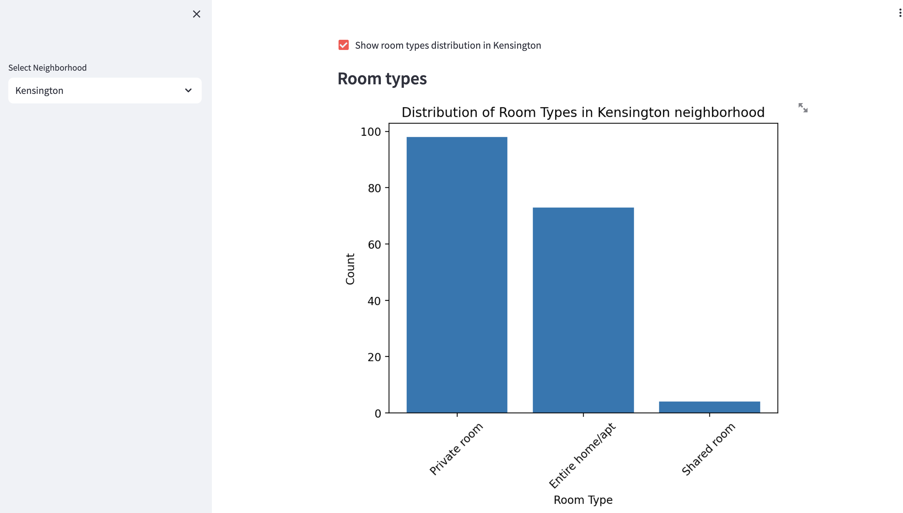

# Airbnb NYC Data Analysis with Streamlit

## Table of content

1. [Introduction](#1-introduction)
2. [Repository Contents](#2-repository-contents)
3. [Getting Started](#3-getting-started)
4. [Running the App in Your Local Machine](#4-running-the-app-in-your-local-machine)
5. [App Highlights](#5-app-highlights)
6. [Additional Information](#6-additional-information)

<br>

## 1. Introduction

This project analyzes Airbnb listings in New York City (NYC) using the Streamlit framework. It provides insights into the distribution of room types, neighbourhood-specific data, and a map visualization of Airbnb listings. The dataset used in this analysis is sourced from Kaggle, [link to Kaggle dataset](https://www.kaggle.com/datasets/dgomonov/new-york-city-airbnb-open-data?resource=download). This README provides an overview of the project, instructions for running the app, and highlights from the data analysis.

<br>

## 2. Repository Contents

This repository contains the following files and directories:

- `airbnb_app.py`: This Python script contains the code for creating the Airbnb NYC Data Analysis app using Streamlit and other libraries. It includes sections for data visualization, filtering by neighbourhood, and more.

- `Dockerfile`: The Dockerfile is provided to allow running the app on any local machine using Docker. It sets up the necessary environment and dependencies to run the Streamlit app.

- `requirements.txt`: This file lists all the Python libraries and dependencies required by the app. It is used by the Dockerfile to ensure that the correct packages are installed.

- `images/`: This directory contains screenshots and images that are used in this README to visually explain the functionality and appearance of the app.

Feel free to explore the code and use the provided Dockerfile and requirements.txt to set up and run the app on your local machine.

<br>


## 3. Getting Started

To run the app, you will need the following prerequisites:

1. Docker Engine: Make sure you have Docker Engine installed and opened. If not, you can download and install it from the [Docker website](https://docs.docker.com/get-docker/).

2. Clone the Repository: Clone this GitLab repository to your local machine.

```bash
git clone https://gitlab.code.hfactory.io/alicia.gonzalez/app_project_alicia.git
```

<br>

## 4. Running the app in your local machine

Follow these steps to run the Airbnb NYC Data Analysis app:

1. Navigate to the project directory.

```bash
cd app_project_alicia
```

2. Build the Docker image using the provided Dockerfile.

```bash
docker build -t app_project_alicia .
```

3. Run the Docker container.

```bash
docker run -p 8501:8501 app_project_alicia
```

4. Open your web browser and visit http://0.0.0.0:8501 to access the app.

<br>

## 5. App Highlights

Here are some highlights from the data visualization app built in the project:

### Data Analysis Customization

To enhance your experience, each section of the data analysis can be shown or hidden as needed. Checkbox options have been provided for ease of navigation and data comparison. Feel free to customize your analysis by displaying the sections that interest you the most.


<br>

### Neighbourhood Analysis

You can filter Airbnb listings by neighbourhood using the sidebar. The app allows you to explore neighbourhood-specific data, including raw data, room type distributions and maps for each neighbourhood.


<br>

### Displaying Raw Data

First, you can explore the raw data used in the analysis:
- To view the complete dataset, you can use the "Show raw data" checkbox in the app. This provides access to the unfiltered Airbnb dataset.
- For a neighbourhood-specific view, the app allows you to filter and display the raw data for your selected neighbourhood.


<br>

### Room Types Distribution

The app displays a histogram of room types, providing insights into the distribution of different types of rooms available on Airbnb in NYC. Both globally and by territorial filter.



<br>

### Map Visualization

The app includes an interactive map that shows the geographical distribution of Airbnb listings. You can view listings for the entire NYC area or filter by a specific neighbourhood.


<br>


## 6. Additional Information

Feel free to explore the code in the project to understand how the data analysis and app functionality are implemented. If you have any questions or suggestions, please don't hesitate to reach out.
